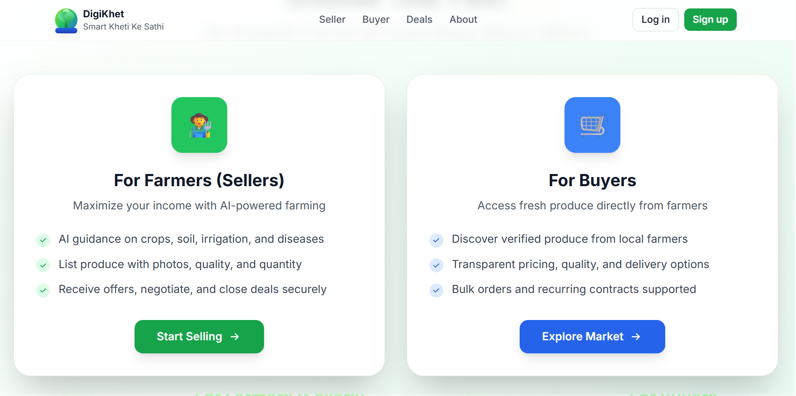

## DigiKhet – Project Overview

# Overview
DigiKhet is a farmer-centric digital platform designed to support timely decision-making and transparent market access in Indian agriculture. The system integrates advisory services with a direct digital marketplace to reduce reliance on intermediaries and enhance income opportunities for farmers, while enabling buyers to access verified produce with transparent pricing. The design emphasizes clarity, interoperability, and scalability, suitable for evaluation by government and academic stakeholders.

# Problem Statement
•	Real-world problem: Farmers navigate fragmented advisory sources and traditional market channels that are often opaque and dominated by intermediaries.
•	Current gaps: Limited price transparency, delayed or uncertain decision support, and constrained direct access to buyers.
•	Why this matters at scale: Agricultural outcomes and farmer livelihoods are sensitive to timely guidance and fair pricing; scalable digital solutions can improve decision quality and market efficiency across diverse regions and crops.

# Proposed Solution
•	What the platform does: DigiKhet combines AI-enabled advisory services with a direct marketplace, enabling farmers to receive agronomic guidance and to list produce for buyers within a single platform.
•	How it addresses each problem point:
o	Timely guidance through structured advisories based on crop, soil, and climate inputs.
o	Direct marketplace reduces dependence on middlemen and increases price visibility.
o	Secure digital payments and transaction records to improve trust and compliance.
•	Why this approach is different: The integration of advisory and marketplace into one coherent workflow aligns decision support with market outcomes, enabling end-to-end visibility from agronomy to sale.

# System Workflow
1.	User signs in as farmer or buyer (or administrative role).
2.	Farmers input or upload crop data, soil characteristics, and irrigation practices; optionally connect sensor data.
3.	System generates advisory guidance (timing, input suggestions, risk alerts) tailored to the user context.
4.	Farmers list produce for sale in the marketplace with applicable quality disclosures.
5.	Buyers review listings, submit offers, and negotiate terms via a secure inbox.
6.	Transactions finalize with digital payment and audit trails; outcome data feeds analytics for continual improvement.

##  Workflow Illustration

*The workflow illustration shows the end-to-end journey from advisory access to marketplace interaction and secure transaction completion.*

# Role of AI / ML 
•	What intelligence is used: Advisory content is supported by rule-based logic and, in later rounds, data-driven models for recommendations and quality scoring. Market analysis modules provide price transparency insights and trend indicators.
•	Why ML is suitable here: Data-driven patterns can enhance agronomic recommendations and improve market decision support as data volumes grow.
•	Emphasis on interpretability and decision support: All AI-driven outputs are accompanied by explanations, confidence indicators, and actionable steps; the system prioritizes transparency to support farmer trust and regulatory scrutiny.

# Technical Architecture
•	Frontend: Responsive web interface designed for accessibility across devices; modular components for advisory panels, marketplace, and transaction inbox.
•	Backend: API-driven architecture with clear separation between advisory services, marketplace services, and user management; supports role-based access control.
•	ML / Data layer: Pluggable modules for agronomic inference, market pricing analytics, and future recommendation engines; emphasis on data provenance and explainability.
•	Design philosophy: Modular, scalable, and policy-aligned; includes audit-ready logging, data governance hooks, and region-agnostic interfaces with locale-aware formatting.

# Key Features 
•	Responsive web interface for farmers and buyers
•	Marketplace UI with crop categories, product listings, and pricing
•	Deals inbox enabling offer negotiation and light workflow management
•	Structured architecture ready for AI integration and future enhancements

## Deals & Negotiation Interface

*The Deals Inbox enables structured offer management, price negotiation, and decision logging, supporting transparent and auditable transactions between farmers and buyers.*

# Feasibility & Scalability
•	Practicality: The modular design supports incremental feature additions (advisory modules, pricing analytics) without overhauling core components.
•	Institutional scalability: Backend services are designed to accommodate regional deployments, with language localization and role-based access to align with governance needs.
•	Constraints acknowledged: Data availability, digital literacy, and network connectivity vary across regions; offline-friendly components and data synchronization strategies are considered in the design.

# Impact & Use Cases
•	Direct beneficiaries: Smallholder farmers, local aggregators, and prospective buyers seeking transparent procurement.
•	Practical outcomes: Timely agronomic guidance, reduced information asymmetry, and auditable market transactions.
•	Alignment with digital governance goals: Supports transparent markets, data-driven policy evaluation, and inclusive access to agricultural information.

# Team & Hackathon Context
•	Hackathon setting: Demonstrates an integrated platform concept with a practical workflow suitable for rapid prototyping and evaluation by industry and academia.
•	Contextual notes: The submission emphasizes verifiable functionality, potential for scalable deployment, and alignment with public-sector digital goals rather than promotional rhetoric.